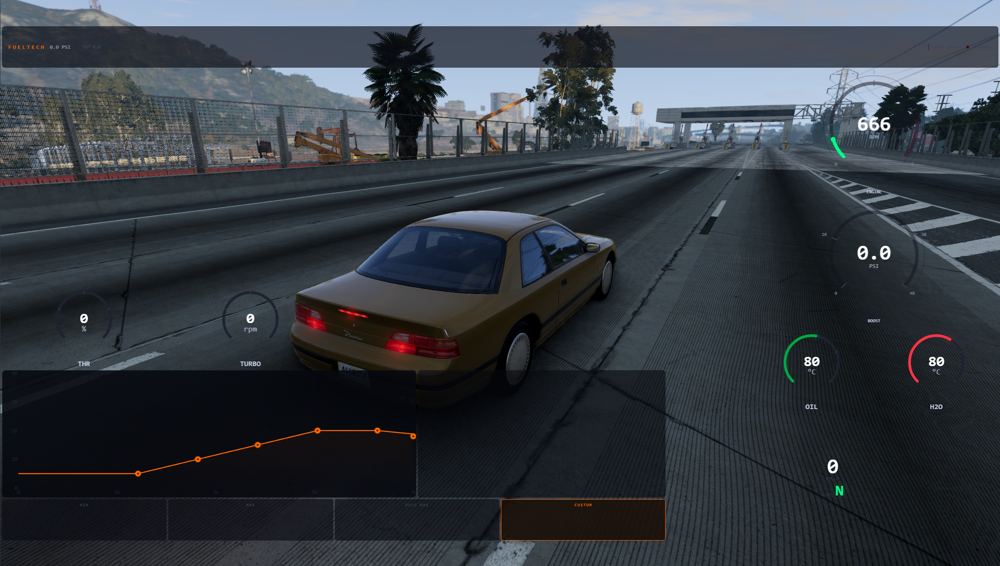

# FuelTech Boost Controller for BeamNG.drive

A FuelTech-inspired boost-by-RPM controller, progressive nitrous system, and telemetry dashboard for BeamNG.drive.

Works with **turbocharged** and **supercharged** vehicles. On naturally aspirated cars, it works as a universal telemetry HUD (boost features auto-hide) and nitrous still works normally.

[](https://github.com/nelitow/fueltech-boost-beamng/releases/latest/download/fueltech_boost_controller.zip)




---

## Installation

**v8.0.0 onward: zero Vehicle Config steps.** The mod auto-attaches to every spawned vehicle via a game-engine extension. Just drop the zip in `mods/` and add the dashboard.

### 1. Download the zip — DO NOT EXTRACT IT

**[⬇ Click here to download `fueltech_boost_controller.zip`](https://github.com/nelitow/fueltech-boost-beamng/releases/latest/download/fueltech_boost_controller.zip)**

Leave it as a `.zip` file. BeamNG loads zipped mods directly — extracting is a common cause of broken installs.

### 2. Drop the zip in your BeamNG mods folder

Open File Explorer and paste **one** of these into the address bar (whichever exists on your system):

```
%USERPROFILE%\Documents\BeamNG.drive\mods
```
```
%LocalAppData%\BeamNG.drive\<version>\mods
```

If the `mods` folder doesn't exist, create it. Then drop the `.zip` directly inside it:

```
mods/
└── fueltech_boost_controller.zip
```

**Do NOT** create an `unpacked` folder, **do NOT** extract, **do NOT** rename.

### 3. Restart BeamNG (or activate the mod from the in-game Mod Manager)

The boost, nitrous, drivetrain, and auto-lights controllers all auto-load on every vehicle from now on — turbo, supercharged, NA, modded — no Vehicle Config step needed.

> **After a major BeamNG update** (e.g. 0.38 → 0.39): the game automatically disables **all** mods as a safety measure. Re-enable FuelTech once in the Mod Manager — this is BeamNG policy, not a bug in the mod.

### 4. Add the dashboard to your screen

1. Press **Esc** → click **HUD Apps** (called *UI Apps* before BeamNG 0.39; the editor now lives under Pause → System).
2. Search for **"FuelTech Dashboard"**.
3. Click to drop it on screen.
4. **Drag the edges** to resize.

### 5. Tune your boost map and nitrous

Press **Esc** → **Mods** tab → **FuelTech Boost**. This pause-menu card is where you drag-edit the boost curve, tune the nitrous RPM/HP shot and per-gear lockout, and adjust ramp/activation settings. Changes sync live to the dashboard.

### 6. Done

The dashboard auto-detects your vehicle:
- **Turbo/supercharged car** — boost PSI gauge, presets, live power/torque graph, ALS.
- **Any car without a native N2O part** — nitrous ARM button, gear-lockout status, added-HP readout.
- **NA car** — RPM, speed, G-force, temps, telemetry only (boost features auto-hide; nitrous still works).

### Still not working?

| Problem | Fix |
|---------|-----|
| Dashboard doesn't appear in HUD Apps | Zip is in the wrong folder. Check both paths in step 2. |
| Mod vanished after a BeamNG update | The game disables all mods on major updates. Re-enable it in the Mod Manager. |
| Dashboard shows but ACTIVE never lights up on a turbo car | The GE extension isn't loading. Restart BeamNG fully (close + reopen, not just main menu). |
| Nitrous button missing | The vehicle already has a native N2O part installed — FuelTech nitrous disables itself rather than fight the stock system over the same torque field. Remove the native N2O part to use FuelTech's version instead. |
| Old saved configs still have a "FuelTech Boost Controller" part listed | Harmless — the legacy N2O-slot jbeam still ships for backwards compatibility. The auto-attach detects the duplicate and skips. |
| Wrong folder structure after extracting | Don't extract — see step 1. Delete the unpacked folder and start over. |

---

## Features

### Boost Control
- **6-point boost-by-RPM map** — drag points to adjust from the pause-menu Mods tab (mouse + touchscreen)
- **Closed-loop PI controller** — targets actual boost, not just wastegate offset
- **Presets** — OFF (0 boost), STOCK (factory wastegate passthrough), MAX (rated max +30%), AUTO MAX (max safe power under the engine's damage-torque limit), CUSTOM
- **Anti-Lag (ALS)** — holds the turbo spooled off-throttle with small pulses, so boost is instant when you get back on it
- **Save/Load profiles** — persist custom maps per vehicle, autosaves across Ctrl+R and reloads
- **Safety cut** — drops boost to 0 if coolant >115°C or oil >135°C

### Progressive Nitrous
- **6-point RPM/added-HP curve** — tune the shot shape from the pause-menu Mods tab, same drag interaction as the boost map
- **Per-gear lockout** — cycle each gear OFF / HALF / FULL power, sized to the vehicle's actual gear count
- **Progressive ramp** — eases in over ~1s once armed at full throttle above the activation RPM, instead of an instant on/off shot
- **Fully custom** — doesn't touch BeamNG's stock N2O device, so it works on any car with an engine (auto-disables on vehicles that already have a real N2O part, to avoid fighting over the same torque field)
- **Realistic fuel burn** — injects torque through the same field the engine's own fuel-consumption model reads, so nitrous use burns extra fuel automatically

### Dashboard
- **Oil temp / Coolant temp** — with overheat warnings
- **G-Force meter** — lateral + longitudinal dot display
- **Drag timer** — 0-100 and 0-200 km/h, auto-starts from standstill
- **Live power/torque graph** — projected vs. stock, read-only (edit the map from the Mods tab)
- **Mini boost-map preview** — always visible, with a live RPM cursor
- **Nitrous status** — ARM / READY / GEAR LOCKED / firing %, plus live added-HP readout
- **Brake temperatures** — per-wheel with blue-green-yellow-red color coding
- **Damage log** — shows engine/brake/tire damage in real time
- **Telemetry strip** — weight, engine load, fuel, exhaust flow, clutch, altitude, odometer, check engine light, low fuel warning
- Defers to BeamNG's stock RPM, speedo, and gear gauges — no duplicate clutter

### Other Vehicle Features
- **Custom TCS** — optional traction control for cars without native TC, off by default
- **Auto headlights** — low beams and fog lights forced on at spawn and on every reset
- **Drive modes** — ESC, TCS, ABS toggles (when available)
- **Shift light** — flashes at 90% redline

### Smart Detection
- Checks `isExisting` on turbo/supercharger/N2O objects (BeamNG creates stubs for all three)
- Turbo: controlled via `setWastegateOffset`
- Supercharger: controlled via `setBypassPressure`
- NA cars: boost features hidden, telemetry HUD + nitrous still work
- Auto-fills viewport on window resize

---

## Usage Tips

| Action | How |
|--------|-----|
| Adjust boost curve / nitrous curve | Pause → Mods → FuelTech Boost, drag the dots |
| Quick boost presets | Click OFF / STOCK / MAX / AUTO MAX / CUSTOM on the dashboard or Mods tab |
| Arm nitrous | Click NITROUS on the dashboard, or ARM N2O in the Mods tab |
| Lock out a gear for nitrous | Tap that gear's button in the Mods tab gear grid |
| View power/torque graph | Click "📈 POWER GRAPH" in the dashboard header |
| Reset peak boost | Click "BOOST PK" in the header |
| Reset drag timer | Click RESET under the timer |

---

## Troubleshooting

**Boost/nitrous curve editor not showing?**
- It only lives in the pause-menu Mods tab now (Esc → Mods → FuelTech Boost) — the dashboard widget shows a read-only graph plus quick presets/toggles.
- Boost features need a turbocharger or supercharger; NA cars only show the telemetry HUD (nitrous still works on NA cars).

**Boost values all 0?**
- This happens when BeamNG's saved config resets the tuning variables. Click the STOCK preset to restore factory boost levels.

**Dashboard too small?**
- Drag the widget edges in the HUD Apps editor (Pause → System on 0.39+) to make it larger. The dashboard auto-fills to whatever size you give it.

**No presets/buttons visible?**
- Presets only appear for turbo/supercharged vehicles. On NA cars they're hidden.

---

## File Structure

```
fueltech_boost_controller/
  lua/ge/extensions/fueltech/
    main.lua                       -- Auto-attach: injects controllers into every spawned vehicle
  lua/vehicle/controller/
    fueltechBoostController.lua    -- Boost control, PI controller, presets, profiles
    fueltechNitrous.lua            -- Progressive nitrous: curve, gear lockout, ramp
    fueltechDrivetrain.lua         -- Mass telemetry, ESC/TCS/ABS detection, custom TCS
    fueltechAutoLights.lua         -- Forces low beams + fog lights on at spawn/reset
  ui/modules/apps/FuelTechBoost/
    app.html / app.js              -- Dashboard (Angular, pre-0.39 fallback)
    app.vue                        -- Dashboard (Vue, BeamNG 0.39+)
    app.css                        -- Shared Nelitomorphism dark theme
    app.json                       -- App metadata
  ui/ui-vue/mods/fueltech/
    index.js                       -- Registers the pause-menu Mods tab card
    FuelTechCard.vue               -- Pause-menu tuner: boost map, nitrous, presets
  vehicles/common/fueltech_boost/
    fueltech_boost.jbeam           -- Legacy N2O-slot part, kept for backwards compatibility
```

## Compatibility

- BeamNG.drive 0.34+ (tested through **0.39**)
- Turbocharged, supercharged, and NA vehicles
- Touch support (Steam Deck / touchscreen)

## License

MIT License — free to use, modify, and distribute.

## Credits

- **Author:** [Nelito](https://github.com/nelitow)
- Dashboard design inspired by [FuelTech](https://www.fueltech.com/) standalone ECUs
